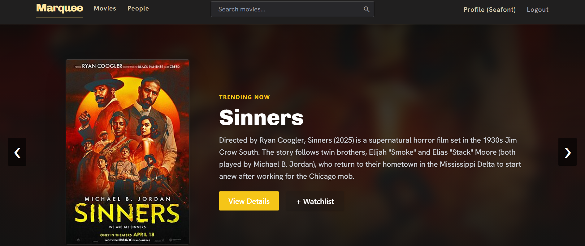
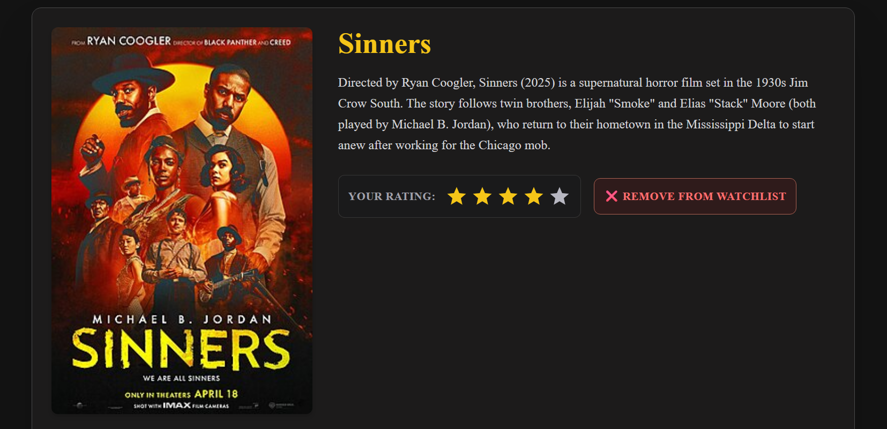
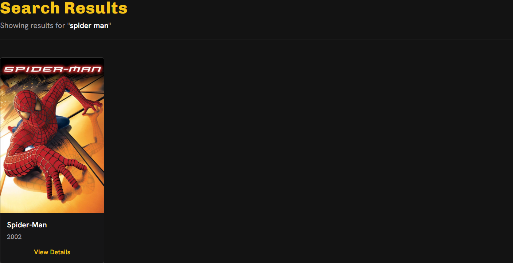

# 🎬 Marquee Movie App

A modern movie discovery web application built with **Django** and **Tailwind CSS**, featuring a cinematic user experience inspired by **Google Stitch** design patterns. Browse, search, and explore movies through a clean, responsive interface designed for movie enthusiasts.

---

## ✨ Features

- 🔍 Search movies by title
- 🎥 Browse movie listings
- 🎭 View detailed movie information
- 🖼️ Rich poster and media displays
- 📱 Fully responsive design
- ⚡ Fast Django-powered backend
- 🎨 Tailwind CSS styling
- 🏷️ Custom Django template tags
- 🎬 Modern, cinematic UI

---

## 🛠️ Tech Stack

### Backend
- Django
- Python

### Frontend
- Tailwind CSS
- HTML5
- JavaScript

### Database
- SQLite3

### Design
- Google Stitch-inspired UI/UX
- Responsive Design

---

## 📂 Project Structure

```text
MARQUEE_APP/
│
├── marquee_app/
│   ├── media/
│   ├── templates/
│   ├── __init__.py
│   ├── asgi.py
│   ├── settings.py
│   ├── urls.py
│   ├── views.py
│   └── wsgi.py
│
├── movies/
│   ├── migrations/
│   ├── templates/
│   ├── templatetags/
│   ├── __init__.py
│   ├── admin.py
│   ├── apps.py
│   ├── forms.py
│   ├── models.py
│   ├── tests.py
│   ├── urls.py
│   └── views.py
│
├── static/
│
├── venv/
│
├── db.sqlite3
├── manage.py
└── README.md
```

---

## 🚀 Installation

### 1. Clone the Repository

```bash
git clone https://github.com/yourusername/marquee-app.git
cd marquee-app
```

### 2. Create a Virtual Environment

```bash
python -m venv venv
```

Activate it:

#### Windows

```bash
venv\Scripts\activate
```

#### macOS/Linux

```bash
source venv/bin/activate
```

### 3. Install Dependencies

```bash
pip install -r requirements.txt
```

### 4. Apply Migrations

```bash
python manage.py migrate
```

### 5. Run the Development Server

```bash
python manage.py runserver
```

Open:

```text
http://127.0.0.1:8000/
```

---

## 🎨 UI & Design

The application uses:

- Tailwind CSS for utility-first styling
- Responsive layouts for all screen sizes
- Google Stitch-inspired design concepts
- Movie-focused visual hierarchy
- Smooth browsing experience

The interface aims to recreate the feeling of browsing a digital movie marquee, placing visual storytelling at the center of the experience.

---

## 📸 Screenshots

### Home Page


### Movie Details


### Search Results


---

## 🔮 Future Improvements

- User authentication
- Personal watchlists
- Favorite movies
- Ratings and reviews
- Movie recommendations
- Trailer integration
- Dark mode support
- Pagination and advanced filtering

---

## 🧪 Running Tests

```bash
python manage.py test
```

---

## 🤝 Contributing

Contributions are welcome.

1. Fork the repository
2. Create a feature branch

```bash
git checkout -b feature/new-feature
```

3. Commit your changes

```bash
git commit -m "Add new feature"
```

4. Push to GitHub

```bash
git push origin feature/new-feature
```

5. Open a Pull Request

---

## 📄 License

This project is licensed under the MIT License.

---

## 👨‍💻 Author

Built with Django, Tailwind CSS, and a love for cinema.

If you enjoyed this project, consider giving it a ⭐ on GitHub.
